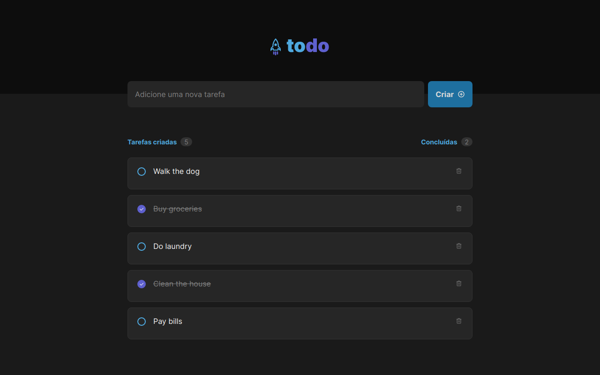

<h1 align="center"> ToDo List </h1>

A modern and efficient web application for managing your daily tasks. Built with React and powered by Jotai, this app leverages the latest web technologies to provide a seamless and intuitive user experience. With Phosphor-React icons and TailwindCSS styling, the app looks sleek and stylish while remaining highly functional. TypeScript provides static type-checking, improving the app's robustness and maintainability. 

  

 

  <h3 align='center'>Web</h3>
  

## ✅ Status

- Finished ✅

## 👨🏼‍💻 Functions

- Task List ( We don't have storage, sorry )

## 🚀 Technologies

This project used the following technologies:

- React
- Typescript
- TailwindCSS
- Phosphor React
- Git e Github
- Jotai

## 💻 Project

This project was developed to solve the first challenge of Ignite's React track

- [Access the project finished, online](https://todo-list-orcin-two.vercel.app/)

## 🔖 Layout

- Access the project layout through [this link](<https://www.figma.com/file/AMVmhNJA2eXP33dpvauLJ7/ToDo-List-(Copy)?node-id=12-106&t=9KyyrWM5n7SbpdLn-0>). A [Figma](https://figma.com) account is required.

## :memo: License

- Excluding the layout, this project is under the license GPL-3
